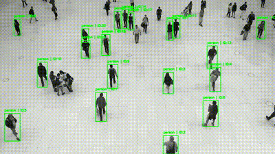

# YOLO + ByteTrack — Real-Time Object Tracking
 
Detect and track **people** and **vehicles** in video using **YOLO26n** and **ByteTrack**.

## Project Overview

This project implements real-time object tracking for people and vehicles in video streams using:

YOLO for object detection.
ByteTrack for robust tracking across occlusions and crowded scenes.
Gradio interface for interactive video input and visualization.

The system outputs structured data:

Bounding boxes for each object.
Unique object IDs.
Timestamps for tracking events.

## Features
- Near real-time tracking.
- Handles occlusions and crowded scenes.
- Supports multiple video formats or webcam input.
- Outputs structured data in JSON or CSV format.
- Interactive Gradio interface for visualization.

## Demos
   

## Output Data
For each frame, the tracker outputs a JSON object containing tracked objects with their bounding boxes, unique IDs, and timestamps, confidence and class name 

Example:
```json 
[
  {
    "frame_index": 0,
    "timestamp_sec": 0.0,
    "track_id": 1,
    "confidence": 0.889,
    "class_name": "car",
    "bbox": {
      "x1": 707,
      "y1": 260,
      "x2": 916,
      "y2": 531
    }
  },
]
```

